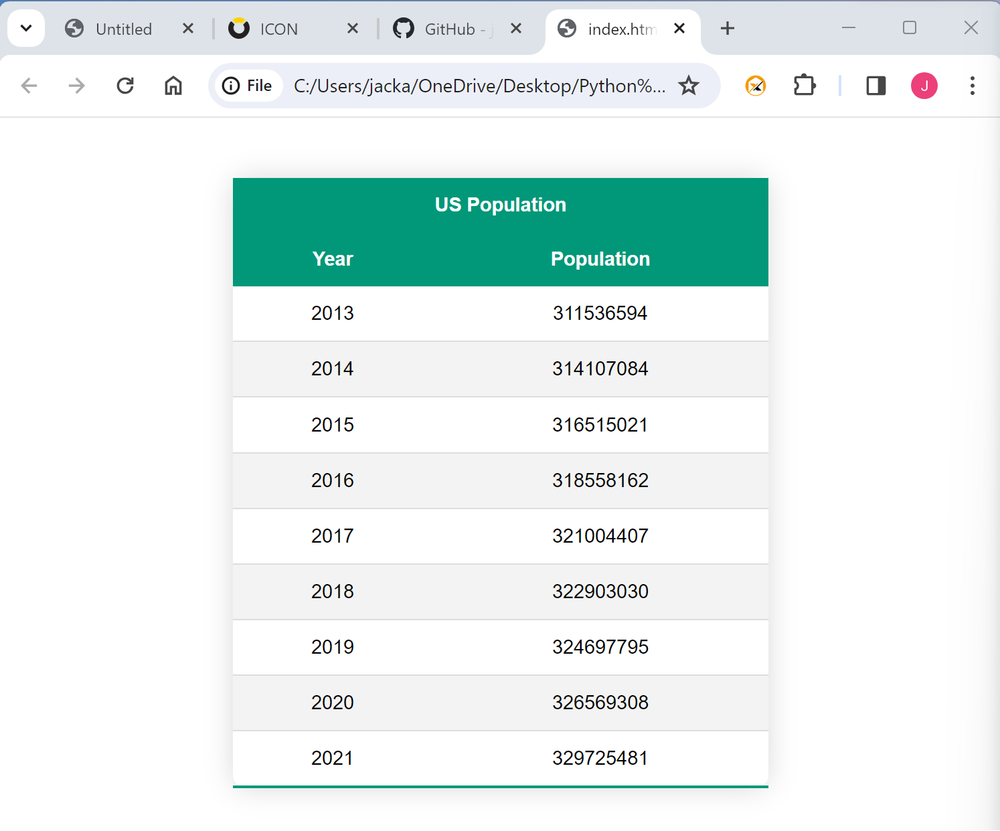

# Goal
The goal of this homework is to create a signle page website that fetches data from a population api on the initial load and displays the information in a table 

# Components 

## index.html
This file contains the boilerplate html that the table with the api data is inserted into 

## main.js
This file has one function that runs on initial load that does the following things 
- Call the api and get the response as json
- Sort the JSON
- Create a table element and parse the JSON data to fill it 

## style.css
Contains basic styles for the table

# Website example 

